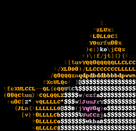

# Converts an image to an ASCII art
## Requirements
```
pip install -r requirements.txt
```

## Usage
```
python imgpro.py [image_filename] [scale]
```

## Sample use
```
python imgpro.py test.png 0.02
```
### Input image


### Output

```


                           `l,
                          ~zLUxi
                         <L0LLOC1'
                        :YOurfu00x,
                        )c|}ko\jCQx'
                     .:<)\|f/jt]{}{<:;
                 `I[tuvYQQ0QQQQQLLCLCC
               >/XL0O0)/LLCCCCCCCLLLLL
             "/Q0QQQznqdpdbddbbbbdpwwm
   '`"::::, ?XcULQc!.]@$$$$$$$$$$$$$$$
 !fcXULCCL--QL{cQQUtC%$$$$$$$$$$$$$$$$
.(00QCtuu}>CQLQQLZ$$$$w/czfa$$$$$$$$$$
 .!u0C[Z*;vQLLLLC*$$$w1JuuJrY$$$$$$$$$
   '{JLn{!LLLLLLO@$$B(jYqU0q)o$$$$$$$$
     ,[v}+0LLLLCb$$$$$%UuCCzj&$$$$$$$$
        .?0LLLLCo$$$$$$$MkbaB$$$$$$$$$
         <QLLLLC#$$$$$$$$$$$$$$$$$$$$$
```